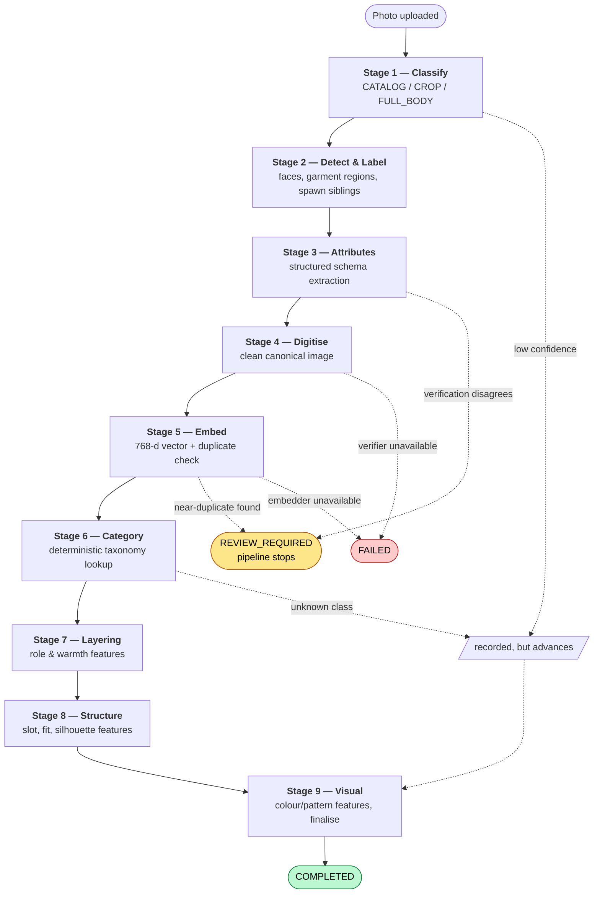
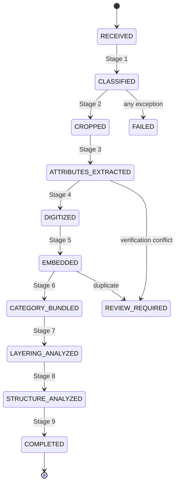
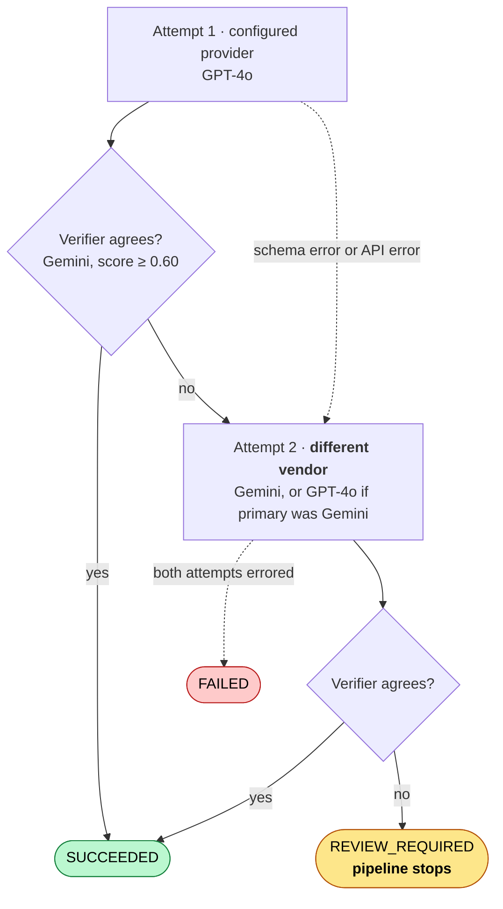
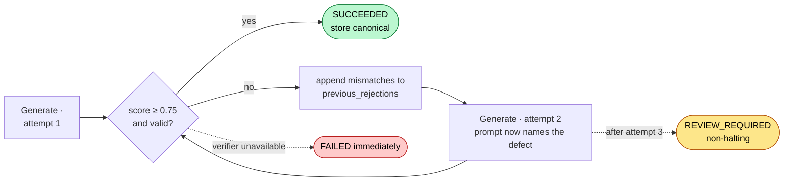
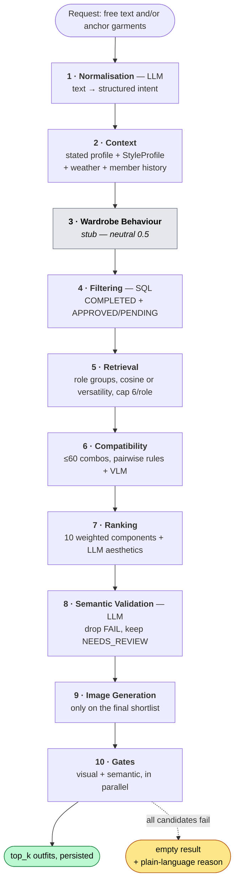
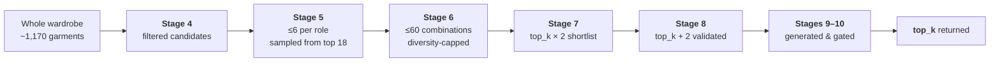
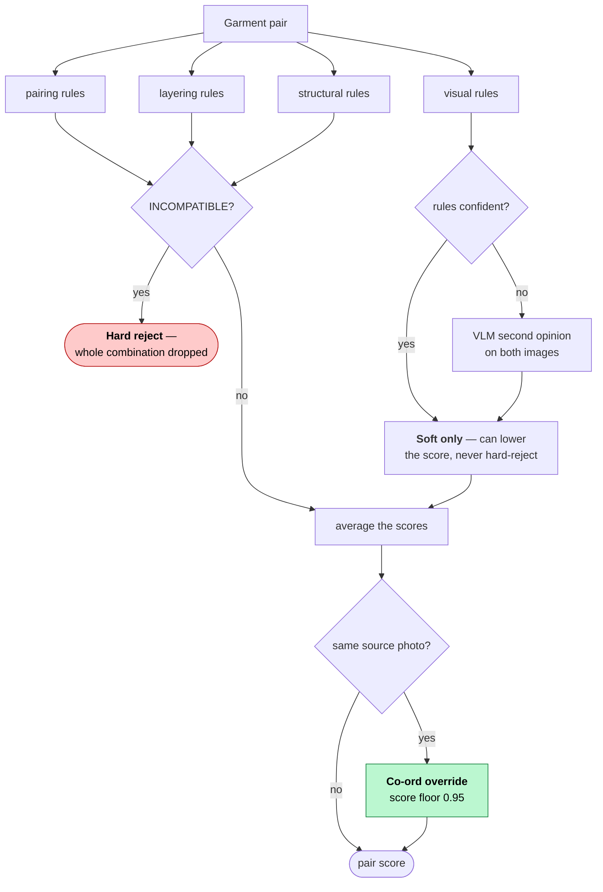
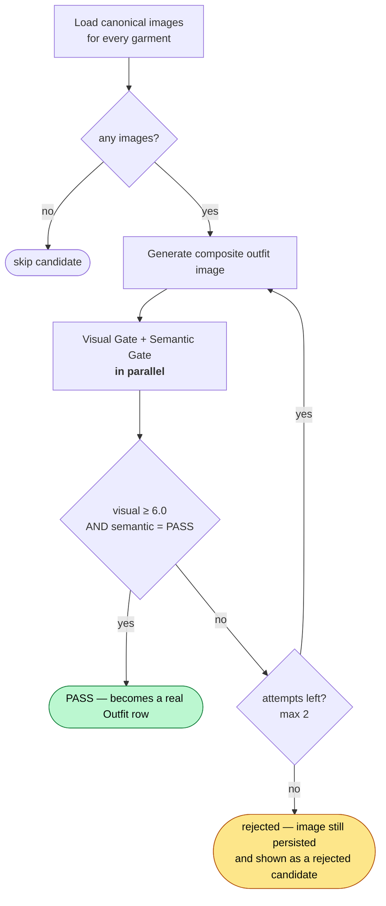

# The Two Pipelines, Stage by Stage

Everything below is read from the code as it stands today, not from the spec. Where a number
appears (a threshold, a retry count, a cap) it is the live value in `app/config.py` or the
module named alongside it.

There are two pipelines and they never run together:

- **Ingestion** turns one uploaded photo into one or more fully-described, embedded garments.
  Nine stages, strictly sequential, one garment at a time.
- **Styling** turns a wardrobe plus a request into ranked, image-generated outfits. Ten stages,
  with concurrency inside several of them.

---

# Part 1 — The Ingestion Pipeline

`app/pipeline/orchestrator.py` · 9 stages · `app/pipeline/stages/stage_01…09`

## 1.1 The shape of it



## 1.2 The state machine

Each stage that succeeds advances the garment one state. `app/pipeline/state_machine.py`:



## 1.3 The three verdicts a stage can return

Every stage returns one of four statuses, and the orchestrator treats them like this:

| Stage returns | What the orchestrator does |
|---|---|
| `SUCCEEDED` | Advance the garment state. Continue. |
| `REVIEW_REQUIRED` **and** the stage is Stage 3 or Stage 5 | Set garment to `REVIEW_REQUIRED`, `quality_status = REVIEW_REQUIRED`, **break**. |
| `REVIEW_REQUIRED` from any other stage | Record it on the stage run for visibility, **advance anyway**, leave `quality_status` alone. |
| `FAILED` or `RETRYABLE` | Set garment to `FAILED`, `quality_status = REJECTED`, **break**. |
| An uncaught exception | Same as `FAILED`. |

That split is deliberate and it is the single most important rule in the pipeline.
`HALTING_REVIEW_STAGES` contains exactly two members:

```python
HALTING_REVIEW_STAGES = {
    PipelineStage.STAGE_03_ATTRIBUTES,  # verification contradicts the extracted attributes
    PipelineStage.STAGE_05_EMBED,       # near-duplicate of a garment already in the wardrobe
}
```

Those two are **findings about the garment**. Everything else — Stage 1 falling back to a
heuristic because a vision call wobbled, Stage 6 not recognising a class — is uncertainty about
the *model*, and stopping the pipeline over it strands garments that would classify correctly a
moment later. That was a live bug; this is the fix.

## 1.4 Retries — the honest table

**The orchestrator itself never retries.** There is no retry loop around a stage, no backoff, no
dead-letter requeue. A failure ends the run. Retries exist only *inside* two stages, and they
are counted per-stage, not per-pipeline.

| Stage | Attempts | Where it comes from | What changes between attempts |
|---|---:|---|---|
| 1 · Classify | **1** | — | — |
| 2 · Detect & label | **1** | — | — |
| 3 · Attributes | **2** | `ATTRIBUTE_MAX_RETRIES = 2` | **A different vendor's model.** Attempt 1 uses the configured provider; attempt 2 uses a genuinely different one. |
| 4 · Digitise | **3** | `DIGITISATION_MAX_RETRIES = 3` | **The rejection reason is fed back into the prompt.** Each failed attempt appends its mismatches to `previous_rejections`. |
| 5 · Embed | **1** | — | — |
| 6 · Category | **1** | — | — |
| 7 · Layering | **1** | — | — |
| 8 · Structure | **1** | — | — |
| 9 · Visual | **1** | — | — |

Re-running a whole garment is a **manual** action: `POST /garments/{id}/retry`, or
`POST /garments/{id}/step` for a single stage, or `PipelineOrchestrator.run(..., force=True)`.

## 1.5 Every threshold in one place

| Setting | Value | Used by |
|---|---:|---|
| `CLASSIFIER_CONFIDENCE_THRESHOLD` | `0.70` | Stage 1 — below this, review (non-halting) |
| `CROP_VERIFICATION_THRESHOLD` | `0.50` | Stage 2 — below this, a non-primary region is dropped |
| `ATTRIBUTE_MAX_RETRIES` | `2` | Stage 3 |
| `ATTRIBUTE_VERIFICATION_THRESHOLD` | `0.60` | Stage 3 — below this, halting review |
| `DIGITISATION_MAX_RETRIES` | `3` | Stage 4 |
| `DIGITISATION_QUALITY_THRESHOLD` | `0.75` | Stage 4 — below this, retry; after 3, review |
| `EMBEDDING_DIMENSION` | `768` | Stage 5 — a mismatch is a hard fail |
| `DUPLICATE_SIMILARITY_THRESHOLD` | `0.97` | Stage 5 — at or above, halting review |

---

## Stage 1 — Image Classifier

`stage_01_classify.py` · model: OpenRouter GPT-4o, or a local face/aspect-ratio heuristic

**In:** the raw uploaded photo.
**Does:** decides whether this is a `CATALOG` shot (retailer product photo), a `CROP` (garment
already isolated), or a `FULL_BODY` (a person wearing things). Writes `garment.image_type`.
**Judgement:** confidence against `0.70`.
**Retries:** none.

| Outcome | Condition |
|---|---|
| `SUCCEEDED` | confidence ≥ 0.70 → `quality_status = APPROVED` |
| `REVIEW_REQUIRED` (non-halting) | confidence < 0.70 — recorded, pipeline **continues** |

The classification is a routing hint for Stage 2, not a contract. Stage 2 re-checks it.

---

## Stage 2 — Person Detection & Garment Region Labelling

`stage_02_crop.py` · algorithm `crop_v2_no_pixel_crop`

**The name is a historical artefact — this stage does not crop pixels.** It used to. Testing
showed that feeding Stages 3 and 4 the *full* photo plus a text label beat feeding them a small
cropped region, on both attribute accuracy and digitisation fidelity, because the model keeps
real scene context: true proportions, drape, where one garment ends and the next begins.

**In:** the full photo, plus Stage 1's `image_type`.
**Does:**

1. Runs detection for a face box and garment regions.
2. **Fast path:** if Stage 1 said CATALOG/CROP *and* detection finds no face, skip everything
   and mark the source photo as the garment's own image. Note the `and` — a "catalog" photo with
   a model in it still goes the long way round.
3. For each detected region, asks a **second, different model** (`VISION_VERIFIER_MODEL`,
   Gemini 3.5 Flash Lite) against the *full* photo: "is there really a garment of this kind here?"
4. Draws an annotated overlay (green face box, blue garment boxes, red for rejected regions) and
   stores it — a UI artefact, not an input to any later stage.
5. **Spawns sibling garments** for every kept region after the first — a co-ord set photographed
   once becomes several garment records, all pointing at the same source photo, distinguished by
   `detected_label`.

**Judgement:** per region, `is_present AND score ≥ 0.50`.

- A **non-primary** region that fails is **dropped entirely** — never spawned. This is what stops
  a detector hallucinating "a belt" out of a patch of pavement.
- The **primary** region is always kept even if flagged, because later stages need something to
  work with. Its real test is Stage 3.

**Retries:** none.
**Outcome:** always `SUCCEEDED`.

**Idempotency:** re-running dedupes siblings on `(source_image_id, detected_label)`, so a second
run can't produce a second batch of the same siblings.

---

## Stage 3 — Attribute Extraction · *halting gate #1*

`stage_03_attributes.py` · algorithm `attr_pipeline_v2_cross_model_retry`

**In:** the full source photo + `detected_label`.
**Does:** extracts the structured garment schema — category, subcategory, colour, pattern,
material, fit, silhouette, sleeve length, occasion, season, layering role, warmth, versatility,
`casual_name`, and the rest. Writes `attributes_json`, `subcategory` and `gender`.

**The retry is cross-vendor, and that is the whole point.** Retrying a failed extraction with
the same model reproduces the same mistake — it is the same model, the same image, the same blind
spot. A kurta-and-dupatta outfit came back as "oxford shirt / blazer / heels" identically on both
attempts before this was changed.



**Judgement:** a separate verifier model looks at the actual image alongside the extracted
attributes and returns `(is_match, score, reason, mismatches)`. Pass is `is_match AND score ≥
0.60`. Every attempt's verdict is kept in `verification_history` and surfaced in the UI.

**Two failure modes are deliberately *not* fatal on their own:**

- a **schema error** from one model (it invented an enum value) — the other model still gets its
  attempt;
- a **real API failure** (timeout, 401, outage) — likewise.

Only if *every* attempt fails that way does the stage raise. This matters because an OpenRouter
outage once produced a `COMPLETED` / `APPROVED` garment whose attributes were entirely fabricated
placeholder values.

| Outcome | Condition |
|---|---|
| `SUCCEEDED` | last attempt verified, score ≥ 0.60 |
| `REVIEW_REQUIRED` **halting** | attempts exhausted, verifier still disagrees |
| `FAILED` | every attempt raised a hard error |

---

## Stage 4 — Digitisation

`stage_04_digitise.py` · model: `openai/gpt-image-2`, falling back to `google/gemini-3.1-flash-image` · verifier: Gemini 2.5 Flash

**In:** the full source photo + `detected_label` + the Stage 3 attributes.
**Does:** generates a clean, standardised canonical image of just that garment — flat, neutral
background, consistent framing. Stores it as a new immutable `ImageAsset` and links it via
`canonical_image_id`. **The source photo is never overwritten.**

**The retry loop carries the defect forward.** A rejected attempt doesn't just re-roll; its
mismatches are appended to `previous_rejections` and injected into the next prompt as a
"Corrections — a previous attempt at THIS garment was REJECTED" block.

**Two models, two vendors.** `OPENROUTER_IMAGE_MODEL` (`openai/gpt-image-2`) is tried first, then
`OPENROUTER_IMAGE_FALLBACK_MODELS` (`google/gemini-3.1-flash-image`). The second entry has to be a
*different vendor*, because a same-vendor fallback is not a fallback: both OpenAI image models
share one safety system, so a garment one refuses the other refuses identically, and the chain is
one policy decision deep. Measured on a Venom graphic tee — `gpt-image-2` and `gpt-5.4-image-2`
both returned HTTP 400 "rejected by the safety system"; Gemini rendered it faithfully. Gemini 3.1
Flash rather than 3 Pro because a side-by-side on the same garment was indistinguishable at half
the cost ($0.068 vs $0.136 per image, against $0.019 for the primary). When the fallback draws the
garment, the run records that it did and what the preferred model said, and the pipeline page
shows both.

**Nothing is ever composited locally.** If every model declines, the stage returns
`REVIEW_REQUIRED` with no canonical image. It used to fall back to an OpenCV grabCut cut-out of
the member's own photo pasted on a blank canvas, reported as `SUCCEEDED` at 0.92 — and the
verifier passed it, because it compares the canonical image against that same photo and they were
identical. So a garment no model would draw was indistinguishable from one that generated
cleanly, while Stage 5 embedded a background-flecked cut-out as the garment's identity for search
and duplicate detection.



**Judgement:** `is_valid AND quality_score ≥ 0.75`, from a verifier that compares the generated
image against the original crop and the attributes.

**One special case worth knowing.** If the *verifier* is unavailable, the stage returns `FAILED`
**immediately** rather than using up the remaining attempts. A broken verifier is not a bad
image — burning two more generations would cost real money and still tell us nothing. And an
unverified canonical image is never stored: that is how belts and hats once ended up rendered,
and then embedded, as dress shirts.

| Outcome | Condition |
|---|---|
| `SUCCEEDED` | an attempt scored ≥ 0.75 |
| `REVIEW_REQUIRED` (non-halting) | all 3 attempts below threshold |
| `REVIEW_REQUIRED` (non-halting) | **no image model would generate** — stops at once, since a content-policy refusal is a fixed property of the photo and retrying returns the same answer |
| `FAILED` | verifier unavailable |

---

## Stage 5 — Embedding & Duplicate Detection · *halting gate #2*

`stage_05_embed.py` · model: MODA SigLIP Distilled (`HopitAI/moda-fashion-distilled`) on RunPod

**In:** the **canonical** image from Stage 4 — fetched by primary key, not through the ORM
relationship. That detail is load-bearing: the orchestrator only flushes between stages, never
commits, and a lazily-loaded relationship can cache as empty even after `canonical_image_id` was
set moments earlier. Three sibling garments once all embedded from the shared *source* photo and
produced identical vectors for genuinely different garments.

**Does:** produces a 768-dimension unit vector and **upserts** it (one row per garment — an
earlier insert-only version stacked duplicate rows that retrieval then read as separate
garments).

**Three checks, in order:**

1. **Availability.** If the embedder can't run, return `FAILED` and **leave no row behind**. The
   old behaviour substituted a hash-seeded mock vector that was indistinguishable from a real one
   once stored — which is how 82% of the wardrobe came to hold noise.
2. **Dimension.** `len(vector) != 768` → `FAILED`.
3. **Norm.** If `| ‖v‖ − 1 | > 0.05`, re-normalise rather than fail.

**Then the duplicate check.** Cosine against every other already-embedded garment for this
tenant, **excluding garments from the same source photo**. Siblings split out of one photo are
the separate items of one outfit, and Stage 4 renders them from that shared photo, so they embed
unusually close. Measured at the 0.97 threshold: **80 of 114 candidate pairs were same-photo
siblings** — without the exclusion, blocking would have rejected a legitimate garment about 70%
of the time.

A match at or above `0.97` is written to `garment.provenance["duplicate_of"]` with the matched
`garment_id`, `similarity`, `subcategory` and `canonical_image_id`, so the UI can say *which*
item this duplicates rather than just that it was blocked — then the stage returns a **halting**
`REVIEW_REQUIRED`. Never silently discarded, never silently accepted.

---

## Stage 6 — Category Bundling

`stage_06_category.py` · **no model at all**

Pure deterministic lookup: `garment_class` → canonical category, via a versioned table in
`app/rules/garment_class.py`. Writes `garment.category` and `garment.garment_class`.

**Judgement:** if the class isn't in the taxonomy, `REVIEW_REQUIRED` (non-halting) rather than a
silent "other" bucket. **Retries:** none.

---

## Stages 7 & 8 — Layering and Structural Features

`stage_07_layering.py`, `stage_08_structure.py` · **no model**

These compute and store features; they don't judge anything. Both always return `SUCCEEDED`.

- **Stage 7** writes `compatibility_features["layering"]`: the garment's `role`
  (base/mid/outer/standalone), its `warmth`, and which roles may sit inside or outside it.
- **Stage 8** writes `compatibility_features["structure"]`: `slot` (the canonical category),
  `fit`, `silhouette`, `sleeve_length`.

Both contain a pairwise-comparison branch that fires only when `ctx.context_data["compare_garment"]`
is set. **Nothing in the running application sets it** — real pairwise comparison happens in the
styling pipeline instead. The branch is kept correct rather than deleted.

---

## Stage 9 — Visual Features & Finalisation

`stage_09_visual.py`

Writes `compatibility_features["visual"]`: colours, pattern, occasions, versatility. Then
finalises: if `quality_status` is not already `REVIEW_REQUIRED`, sets it to `APPROVED` and the
garment to `COMPLETED`.

Same unreachable pairwise branch as Stages 7–8, with a VLM fallback when the deterministic
visual rules aren't confident.

---

## 1.6 Idempotency and resume

Before running any stage, the orchestrator looks up **the most recent** `PipelineStageRun` for
that garment and stage, ordered by `started_at`, and skips the stage only if that most recent
run succeeded.

Two subtleties, both from live bugs:

- **"Most recent", not "any succeeded".** A Stage 3 attempt that succeeded with wrong attributes
  and was later re-verified to `REVIEW_REQUIRED` would otherwise have its stale successful row
  picked up on a later full-pipeline retry, resurrecting the already-rejected extraction.
- **Ordered by `started_at`, not `attempt`.** Attempt numbers are computed independently by the
  orchestrator and by the `/step` endpoint, so the same number can legitimately appear twice.
  Only the timestamp identifies what actually ran last.

`force=True` bypasses the skip. `resume_stage=X` slices the stage list to start at X.

---

# Part 2 — The Styling Pipeline

`app/styling/orchestrator.py` · 10 stages

## 2.1 The shape of it



## 2.2 The funnel, with real numbers



The narrowing is the whole design: expensive work only ever happens on a small set. Image
generation never touches the full candidate pool.

## 2.3 Retries in styling

| Stage | Retries | Notes |
|---|---:|---|
| 1 · Normalisation | **0** | One LLM call. Skipped entirely if no `request_text`. |
| 2 · Context | **0** | No model call. |
| 3 · Wardrobe behaviour | **0** | Stub. |
| 4 · Filtering | **0** | SQL. |
| 5 · Retrieval | **0** | Local numpy. |
| 6 · Compatibility | **0** | Rules, with a VLM call only when visual rules are inconclusive. |
| 7 · Ranking | **0** | Aesthetic LLM calls run **concurrently** across all survivors. |
| 8 · Semantic validation | **0** | All candidates validated **concurrently**. |
| 9 + 10 · Generate & gate | **2** | `STYLING_IMAGE_MAX_RETRIES = 2`. One loop covers generation *and* both gates. |

Stages 9 and 10 appear separately in the trace but are **one function** —
`generate_and_run_gates()`. Each attempt generates an image and then runs both gates on it; a
gate failure retries the *generation*, not just the check.

Two other forms of resilience that aren't retries:

- **Fallback depth.** `GATE_FALLBACK_DEPTH = 2` — Stage 8 validates `top_k + 2` candidates, so a
  candidate that dies at the gates is replaced by the next-best rather than shrinking the result.
- **Never filter to zero.** Stage 4's colour and gender filters fall back to the unfiltered list
  if they would empty it.

---

## Stage 1 — Request Normalisation

**Model:** OpenRouter (`STYLING_NORMALIZER_PROVIDER`). **Skipped** if the request carries only
anchor garments and no text.

Turns *"something smart for dinner but not too formal"* into a `StylingIntent`: occasion,
formality, colours, weather, gender.

**Gender has a fallback chain** that matters commercially: if the request doesn't state one, the
account's own `gender` preference is used. Without it, Stage 4 has nothing to narrow a
mixed-gender wardrobe by, and the pipeline spends real money building, validating and
**generating images for** outfits in a gender the member never wanted.

---

## Stage 2 — Contextual Analysis

No model call. Assembles four layers into `StylingContext`:

1. **The member's stated profile** (`app/styling/member_signals.py`) — colour analysis,
   onboarding preferences, weekly plan, hard constraints and climate, in production's own
   shapes (`consumer_interaction_profiles.color_analysis`, `consumer_profiles.preferences`,
   `weekly_plan`). In this deployment that is the evaluation character's `Persona` row; ordinary
   accounts get an empty profile and the stage behaves as before. Production carried a colour
   analysis for 60 of 72 members and never passed it in — `user_preferences` was `{}` on all
   5,736 requests.
2. **The learned `StyleProfile`** — `boldness_preference` and `attribute_affinities`, moved by
   outfit up/downvotes. Affinities are layered per attribute value, lowest first: palette
   (named hues within 30° of a colour-analysis swatch, plus the temperature's neutrals) → stated
   (colours loved and avoided, fits loved, avoid-words like "florals") → learned. One real vote
   on a value replaces its prior; untouched values keep it. `app/rules/member_signals.py`.
3. **Real weather**, when the request carries a `WeatherSnapshot` (Outfit-of-the-Day always
   does). The feels-like temperature becomes `environment.warmth_target`, a continuous 0–1
   warmth the outfit should average, and Stage 7's `weather_fit` scores against it instead of the
   request's weather word. Today's weekly-plan entry also lands in `environment.today`, and its
   first tag becomes `intent.occasion` when the request named none.
4. **Language for the LLM stages** — `derive_member_context` (past *member-initiated* requests,
   recent asks quoted verbatim, wardrobe composition, the stated profile) plus `taste_notes` and
   `recent_asks` in `behavioral_signals`. Stage 8 and the aesthetic scorer receive the palette,
   stated colours, hard constraints, weather and today's plan as labelled data lines
   (`describe_member_profile`).

**Hard constraints** split in two: the ones garment attributes can express (`no_sleeveless`,
`no_heels`, `no_leather`, `quick_dry_only`, `no_jeans`, `high_neckline_only`, …) are enforced
in code at Stage 4; the rest (`needs_pockets`, `turban_colour_coordination`) go to the prompts as
text. Neither kind is dropped.

**The circularity fix.** Outfit-of-the-Day synthesises its request text *from* this stage's
summary and persists it like any request. Unfiltered, the history query reads its own prompts
back (production: every one of the 5,736 requests) and the summary converges on whatever it said
first. Requests an OOTD row points at, and anything starting with the OOTD prompt prefix, are
excluded from history.

An explicit `boldness_preference` on the request **overrides** the learned value for that request.

---

## Stage 3 — Wardrobe Behaviour

**A stub, and the trace says so.** There is no wear log, so every garment scores a neutral `0.5`.
It carries 6% of the final score weight.

---

## Stage 4 — Attribute Candidate Filtering

Pure SQL, deliberately cheap — the whole wardrobe is never sent to a model.

**Hard filters:** `tenant_id`, `member_id`, `status = COMPLETED`, `quality_status IN (APPROVED,
PENDING)`.
**Soft filters:** colour (from intent) and gender — each with the `or candidates` fallback that
refuses to return an empty list on a soft preference.
**Hard constraints** (from Stage 2, `apply_hard_constraints`): a garment whose attributes plainly
violate one of the member's constraints is removed before retrieval. Anchors are exempt but the
violation is named in the trace. A wardrobe where *everything* violates is left untouched and
flagged `fell_back` — that is a data problem to surface, not a reason to return nothing.

Anchor garments are loaded separately and **authorisation-scoped**: an anchor belonging to
another member raises rather than being quietly ignored.

---

## Stage 5 — Candidate Retrieval

Groups candidates by canonical role (TOP, BOTTOM, ONE_PIECE, FOOTWEAR, OUTERWEAR), then scores
within each role:

- **With anchors:** cosine similarity to the anchor embeddings, in plain numpy over the already
  small filtered set — not a pgvector SQL query, so it behaves identically on Postgres and on
  SQLite in tests.
- **Without anchors** (the common free-text case): the garment's static `versatility`, **plus
  `random.uniform(0, 0.35)` of jitter**. Without the jitter, every request returns the same
  handful of highest-versatility garments and the member sees the same outfits forever.

Then `_sample_top_pool` takes a **weighted-random** draw of 6 (`STYLING_MAX_CANDIDATES_PER_ROLE`)
from the top 18, rather than a strict top-6 cut — variety again, one layer deeper.

---

## Stage 6 — Combination Assembly & Compatibility

### Assembly (`combinator.py`)

Body coverage is either **TOP + BOTTOM** or **ONE_PIECE**. Footwear is added when available.
Outerwear is added as an *optional extra variant* per base combo — and **skipped entirely** for
`party`, `formal` and `evening` requests, where a layered coat reads as "outfit plus a coat"
rather than the look itself.

Two scoring details, both from observed failures:

- **Combination scores are averaged, not summed.** A ONE_PIECE + FOOTWEAR combo has fewer terms
  than TOP + BOTTOM + FOOTWEAR, so summing systematically buried it. With a real 6-item ONE_PIECE
  pool available, **zero** ONE_PIECE combos survived into the cap before this changed.
- **The cap is diversity-aware.** Of 60 combos kept by raw score alone, effectively all shared
  the same bottom *and* the same footwear. `_diversity_capped` greedily picks by
  `score − max_jaccard_similarity_to_already_selected` instead. The ranking stage's own diversity
  penalty can only reshuffle what survives this cap, so variety has to be preserved here.

`MAX_COMBOS_TO_EVALUATE = 60`.

### Compatibility (`compatibility.py`)

Every pair in a combination is checked against four rule sets:



**Pairing, layering and structural failures hard-reject. Visual dissociation never does** — it
can push a pair to `REVIEW_REQUIRED` at worst. Two bottoms is physically impossible; a colour
clash is a matter of taste.

**The co-ord override** is the nicest rule in the pipeline. If two garments share a
`source_image_id`, they came out of the same photo — which means the person was *actually
photographed wearing both*. That isn't a hypothesis, it's a fact, so a soft visual-dissociation
flag is moot and the pair is forced to `COMPATIBLE` with a score floor of `0.95`. A genuine hard
reject still stands: co-ingestion can't make two bottoms wearable, it can only mean the detector
mis-split one garment in two.

---

## Stage 7 — Ranking

Ten weighted components, summed and clamped to `[0, 1]`:

| Component | Weight | Source |
|---|---:|---|
| `request_match` | **0.17** | intent formality/colour/occasion overlap |
| `compatibility` | **0.17** | Stage 6's average pair score |
| `aesthetic_score` | **0.15** | **LLM, holistic** — judges the whole look at once |
| `user_preference` | 0.13 | how well harmony matches `boldness_preference` |
| `occasion_fit` | 0.13 | formality distance, + 0.15 for ONE_PIECE on dressy requests |
| `visual_harmony` | 0.08 | pairwise rule average |
| `wardrobe_behavior` | 0.06 | *stub — 0.5* |
| `weather_fit` | 0.04 | outfit warmth vs the real feels-like temperature (`environment.warmth_target`), else the request's weather word |
| `attribute_affinity` | 0.04 | colours/patterns/fits this member has upvoted, stated at onboarding, or that their colour analysis flatters — learned wins per value |
| `novelty` | 0.03 | *stub — 1.0* |

`aesthetic_score` is the one that judges an outfit **as a composition**, the way a stylist
reasons — distinct from `visual_harmony`, which is a pairwise "won't clash" average.

**Ranking runs in two passes, and the reason is latency.** Pass 1 does compatibility and every
cheap local component sequentially. Pass 2 fires *all* the aesthetic LLM calls at once via
`asyncio.gather`. Serialised, this stage took **4m53s** per request; concurrent, **2m42s**.

Two more rules:

- **The optional outerwear layer must earn its place.** A layered variant is only kept if its
  final score beats its base combo by more than `LAYER_IMPROVEMENT_EPSILON = 0.01`.
- **Diversity penalty.** The shortlist is re-ranked greedily by
  `final_score − max_jaccard_similarity_to_already_selected`.

Shortlist size handed to Stage 8: `max(top_k × 2, top_k + 2)`.

---

## Stage 8 — Semantic Validation

One LLM call per candidate, **all concurrent**. Asks whether the outfit actually makes sense for
*this request*.

| Verdict | Action |
|---|---|
| `FAIL` | dropped, counted in `dropped_for_fail` |
| `NEEDS_REVIEW` | **kept**, flagged |
| `PASS` | kept |

Accepts up to `top_k + GATE_FALLBACK_DEPTH` (= `top_k + 2`).

Every candidate's result — including the dropped ones, with their reasons — is written to the
trace. That's what lets the frontend explain an empty result instead of showing a blank screen.

---

## Stages 9 & 10 — Generation and the Gates

One function, `generate_and_run_gates()`, run **concurrently across all surviving candidates**.



**Both gates run on the generated image, in parallel**, via `asyncio.gather`. Pass requires
`visual.score ≥ 6.0` **and** `semantic.status == "PASS"`.

**Failed candidates keep their image.** It's persisted as an `ImageAsset` and surfaced in the
stage-detail UI as a rejected candidate. Only *accepted* outfits become `Outfit` rows — but the
evidence of why something was rejected isn't thrown away.

Once `top_k` outfits have passed, the loop stops; the remaining pool was unused headroom.

---

## 2.4 When nothing comes back

`derive_no_outfit_reason()` turns the trace into one plain sentence, distinguishing the two
genuinely different failures:

- **Candidates passed Stage 8 but every one failed the gates** → *"N candidate combination(s)
  passed semantic validation, but none passed the final generated-image quality check."*
- **Nothing survived Stage 8** → the actual rejection reasons, up to three, deduplicated.
- **Nothing was ever assembled** → *"No compatible garment combinations could be assembled from
  this wardrobe for this request."*

The same function works on a live run and on a replayed persisted request, so both paths give the
caller the same answer.

---

# Part 3 — The two rules that shaped both pipelines

**1 · Never substitute a plausible stand-in for a real result.**

This anti-pattern was found three separate times, and each time it had silently corrupted data
that looked perfectly healthy:

| Where | What it faked | How it surfaced |
|---|---|---|
| Embedding provider | a hash-seeded random vector when RunPod was down | **82% of the wardrobe** held noise; near-duplicate detection and retrieval were meaningless |
| Attribute provider | generic placeholder attributes on an API error | an OpenRouter outage produced `COMPLETED` / `APPROVED` garments with entirely fabricated attributes |
| Digitisation verifier | `(True, 0.9, "ok")` when the verifier couldn't run | unverified canonical images were stored — belts and hats rendered as dress shirts |

All three now raise `EmbeddingUnavailableError` or `VerifierUnavailableError`. A stage that
cannot do its job says so.

**2 · Never silently discard.**

Every rejection is recorded with its reason and made inspectable — a dropped detection region, a
rejected attribute extraction with all its attempts, a failed digitisation with its mismatches,
a duplicate with the exact garment it matched and the similarity score, a gated-out outfit with
its generated image still attached. Human review is always the destination, never the bin.
